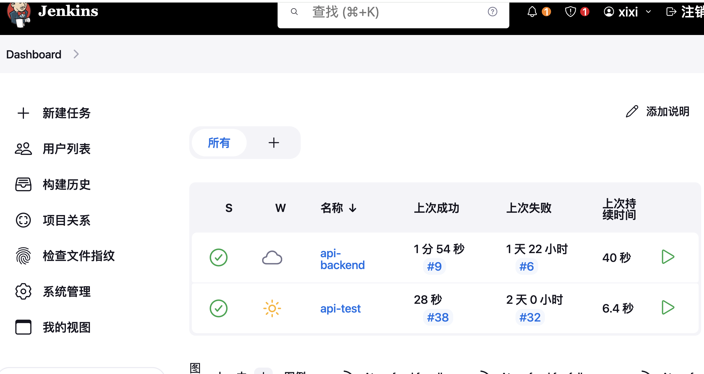

# interface_automation

#### 介绍
pytest+requests+allure+yaml接口自动化测试

#### 软件架构
软件架构说明
接口测试自动化代码，jenkins+pytest+requests+allure+yaml, 实现测试环境和生产环境切换，测试数据分离，持续集成，多环境测试数据，在线查看测试报告。
接口后端服务由另一个仓库gin_api提供，jenkins+docker，实现持续集成和部署。

#### 使用说明
1. 可在线体验，登录Jenkins，账号：qian，密码：admin

   jenkins地址：

2. 选择项目api-test，选择构建，默认为test测试环境，点击构建
    

   

   

   

3. 构建完成后，点击allure report，可在线查看测试报告。

   

#### 参与贡献

1.  Fork 本仓库
2.  新建 Feat_xxx 分支
3.  提交代码
4.  新建 Pull Request

#### 特技

1.  使用 Readme\_XXX.md 来支持不同的语言，例如 Readme\_en.md, Readme\_zh.md
2.  Gitee 官方博客 [blog.gitee.com](https://blog.gitee.com)
3.  你可以 [https://gitee.com/explore](https://gitee.com/explore) 这个地址来了解 Gitee 上的优秀开源项目
4.  [GVP](https://gitee.com/gvp) 全称是 Gitee 最有价值开源项目，是综合评定出的优秀开源项目
5.  Gitee 官方提供的使用手册 [https://gitee.com/help](https://gitee.com/help)
6.  Gitee 封面人物是一档用来展示 Gitee 会员风采的栏目 [https://gitee.com/gitee-stars/](https://gitee.com/gitee-stars/)
